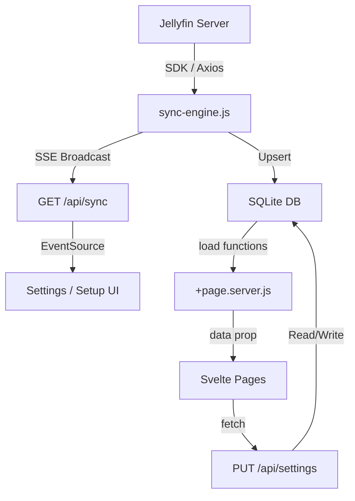

# Mediajam — Technical Documentation

> **Purpose**: Beautiful analytics dashboard for a [Jellyfin](https://jellyfin.org/) media server. Syncs TV shows, movies, and music data from Jellyfin into a local SQLite database, then renders interactive dashboards with charts, tables, and stats.

---

## Technology Stack

| Layer | Technology | Version / Notes |
|-------|-----------|-----------------|
| **Framework** | [SvelteKit](https://kit.svelte.dev/) | v2, using Svelte 5 with `$props()`, `$state()`, `$effect()` runes |
| **Adapter** | `@sveltejs/adapter-node` | Produces a standalone Node.js server |
| **Database** | SQLite via `better-sqlite3` | Synchronous API, WAL mode, foreign keys enabled |
| **Styling** | Tailwind CSS v4 + [daisyUI](https://daisyui.com/) v5 | 30+ themes, all enabled via `@plugin 'daisyui' { themes: all; }` |
| **Charts** | [CanvasJS](https://canvasjs.com/) | Client-side only, dynamically imported |
| **Jellyfin Client** | `@jellyfin/sdk` v0.13 | Official SDK wrapping Axios for HTTP |
| **Auth** | `bcryptjs` | For local-account password hashing |
| **HTTP** | `axios` (via Jellyfin SDK) | All Jellyfin API calls use Axios internally |
| **Font** | Google Fonts — Inter (300–800) | Loaded via `<link>` in `app.html` |
| **Runtime** | Node.js 20 | Docker base image `node:20-slim` |

---

## Project Structure

```
mediajam/
├── Dockerfile                  # Multi-stage build (builder → production)
├── package.json                # Dependencies & scripts
├── svelte.config.js            # SvelteKit config (adapter-node)
├── vite.config.js              # Vite config (sveltekit plugin only)
├── postcss.config.js           # PostCSS with @tailwindcss/postcss
├── jsconfig.json               # Path aliases ($lib → src/lib)
├── static/
│   └── favicon.png
└── src/
    ├── app.html                # HTML shell with data-theme="dark", Inter font, meta tags
    ├── app.css                 # Tailwind import, daisyUI plugin, scrollbar styles, animations
    ├── app.d.ts                # Type declarations (App.Locals: isSetupComplete, theme)
    ├── hooks.server.js         # Server hook: setup guard, theme injection
    ├── lib/
    │   ├── index.js            # Re-export barrel (currently empty/minimal)
    │   ├── assets/             # Static assets
    │   ├── components/
    │   │   ├── Chart.svelte         # CanvasJS wrapper (dynamic import, dark theme)
    │   │   ├── DataTable.svelte     # Sortable, searchable, paginated table
    │   │   ├── StatCard.svelte      # Glassmorphic stat card with icon
    │   │   ├── ThemeSwitcher.svelte # Dropdown theme picker (30+ daisyUI themes)
    │   │   └── setup/
    │   │       ├── StepDiscover.svelte    # Step 1: Auto-discover Jellyfin server
    │   │       ├── StepAuth.svelte        # Step 2: Authenticate (Jellyfin or local)
    │   │       ├── StepLibraries.svelte   # Step 3: Select libraries to track
    │   │       ├── StepApiKeys.svelte     # Step 4: Optional TVDB/TMDB/MusicBrainz keys
    │   │       └── StepSync.svelte        # Step 5: Initial data sync with SSE progress
    │   └── server/
    │       ├── db.js            # SQLite connection + full schema initialization
    │       ├── jellyfin.js      # Jellyfin SDK wrapper (createApi, sub-API getters)
    │       └── sync-engine.js   # Core sync engine (585 lines, SSE broadcast)
    └── routes/
        ├── +layout.server.js    # Root layout load: settings, sync state, libraries
        ├── +layout.svelte       # App shell: navbar, tabs (TV/Movies/Music), theme switcher
        ├── +page.server.js      # Home page load: aggregate counts across all media
        ├── +page.svelte         # Home dashboard: StatCards + quick-nav cards with progress bars
        ├── tv/
        │   ├── +page.server.js  # TV stats: show counts, episode stats, completion buckets
        │   ├── +page.svelte     # TV dashboard: charts (watch pie, collection pie, top shows bar, shows-by-year area) + DataTable
        │   └── [id]/
        │       ├── +page.server.js  # Single show detail: episodes grouped by season
        │       └── +page.svelte     # Show detail page with season accordion
        ├── movies/
        │   ├── +page.server.js  # Movie stats: watch status, decade/year distribution, most rewatched
        │   └── +page.svelte     # Movies dashboard: charts (watch pie, decade bar, year area, rewatched bar) + DataTable
        ├── music/
        │   ├── +page.server.js  # Music stats: artist/album counts, collection buckets, play counts
        │   ├── +page.svelte     # Music dashboard: charts (top artists bar, collection pie, distribution, plays bar) + DataTable
        │   └── [id]/
        │       ├── +page.server.js  # Single artist detail: albums with track listing
        │       └── +page.svelte     # Artist detail page with album cards
        ├── settings/
        │   └── +page.svelte     # Settings page: Jellyfin URL, API keys, theme, re-sync trigger with SSE console
        ├── setup/
        │   └── +page.svelte     # Setup wizard: 5-step onboarding flow
        └── api/
            ├── sync/+server.js           # POST: start/pause/resume/stop sync; GET: SSE stream
            ├── settings/+server.js       # GET/PUT: app_settings CRUD
            ├── backfill/+server.js       # POST: backfill total_released_children from Jellyfin
            ├── tracks/[albumId]/+server.js  # GET: fetch tracks for an album from Jellyfin
            └── setup/
                ├── discover/+server.js   # POST: probe Jellyfin server URLs
                ├── auth/+server.js       # POST: authenticate (Jellyfin or local account)
                └── libraries/+server.js  # GET: list Jellyfin libraries; POST: save selected libraries
```

---

## Database Schema

The database is a single SQLite file (`mediajam.sqlite` in dev, `/app/data/mediajam.sqlite` in Docker). Schema is auto-created on startup in [db.js](file:///home/rappo/Documents/projects/mediajam/src/lib/server/db.js).

### Tables

#### `app_settings` (singleton, `id = 1`)
| Column | Type | Description |
|--------|------|-------------|
| `jellyfin_url` | TEXT | Base URL of the Jellyfin server |
| `theme` | TEXT | Current daisyUI theme name (default: `dark`) |
| `tvdb_api_key` | TEXT | Optional TVDB API key |
| `tmdb_api_key` | TEXT | Optional TMDB API key |
| `musicbrainz_api_key` | TEXT | Optional MusicBrainz API key |
| `include_specials` | INTEGER | Whether to include specials (0/1) |
| `setup_complete` | INTEGER | Whether initial setup is done (0/1) |

#### `users`
| Column | Type | Description |
|--------|------|-------------|
| `id` | INTEGER PK | Auto-increment |
| `username` | TEXT UNIQUE | Login username |
| `password_hash` | TEXT | bcrypt hash (local accounts only) |
| `jellyfin_user_id` | TEXT | Jellyfin user ID (Jellyfin auth) |
| `jellyfin_access_token` | TEXT | Jellyfin API access token |
| `is_admin` | INTEGER | Admin flag (default: 1) |
| `created_at` | TEXT | ISO datetime |

#### `sync_state` (singleton, `id = 1`)
| Column | Type | Description |
|--------|------|-------------|
| `status` | TEXT | `idle`, `syncing`, `paused`, `error` |
| `current_task` | TEXT | Description of current sync activity |
| `progress_percent` | INTEGER | 0–100 |
| `items_synced` | INTEGER | Count of items synced in current run |
| `items_total` | INTEGER | Total items expected |
| `errors` | INTEGER | Error count in current run |
| `last_sync_timestamp` | TEXT | ISO datetime of last completed sync |
| `log` | TEXT | JSON-serialized log array (legacy, mostly unused now) |

#### `libraries`
| Column | Type | Description |
|--------|------|-------------|
| `jellyfin_id` | TEXT PK | Jellyfin library ID |
| `name` | TEXT | Library display name |
| `media_type` | TEXT | `tvshows`, `movies`, or `music` |
| `is_tracked` | INTEGER | Whether to sync this library (0/1) |

#### `media_parents` — Top-level media items (Shows, Movies, Artists)
| Column | Type | Description |
|--------|------|-------------|
| `id` | INTEGER PK | Auto-increment |
| `jellyfin_id` | TEXT UNIQUE | Jellyfin item ID |
| `library_id` | TEXT FK → `libraries` | Which library this belongs to |
| `title` | TEXT | Display title |
| `media_type` | TEXT | `show`, `movie`, or `artist` |
| `tvdb_id`, `tmdb_id`, `imdb_id`, `musicbrainz_id` | TEXT | External provider IDs |
| `release_year` | INTEGER | Premiere/release year |
| `poster_url` | TEXT | Full URL to Jellyfin poster image |
| `overview` | TEXT | Synopsis/description |
| `jellyfin_user_rating` | REAL | User's rating on Jellyfin |
| `total_released_children` | INTEGER | Total episodes/albums released (for collection %) |
| `collected_children` | INTEGER | Episodes/albums in your library |
| `watched_children` | INTEGER | Episodes/albums marked watched |

#### `media_children` — Child items (Episodes, Movies-as-children, Albums)
| Column | Type | Description |
|--------|------|-------------|
| `id` | INTEGER PK | Auto-increment |
| `parent_id` | INTEGER FK → `media_parents` | Parent relationship |
| `jellyfin_id` | TEXT UNIQUE | Jellyfin item ID |
| `title` | TEXT | Episode/album title |
| `season_number` | INTEGER | Season number (TV); NULL for movies/music |
| `item_number` | INTEGER | Episode number / production year (albums) |
| `is_special` | INTEGER | 1 if season 0 (specials) |
| `is_collected` | INTEGER | 1 if on disk, 0 if virtual/missing |
| `watch_status` | TEXT | `watched`, `in_progress`, `unwatched` |
| `play_count` | INTEGER | Number of times played |
| `external_api_id` | TEXT | External provider ID |
| `runtime_ticks` | INTEGER | Duration in Jellyfin ticks (10M ticks = 1 second) |

### Indexes
- `idx_media_parents_type` on `media_parents(media_type)`
- `idx_media_parents_library` on `media_parents(library_id)`
- `idx_media_children_parent` on `media_children(parent_id)`
- `idx_media_children_status` on `media_children(watch_status, is_collected)`

---

## Core Server Modules

### `db.js` — Database Connection
- Creates a `better-sqlite3` instance at `mediajam.sqlite`
- Enables WAL mode and foreign keys
- Runs the full `CREATE TABLE IF NOT EXISTS` DDL on import
- Inserts singleton rows for `app_settings` and `sync_state`
- Exports the `db` instance as default

### `jellyfin.js` — Jellyfin SDK Wrapper
- Initializes the `@jellyfin/sdk` client with app metadata (`Mediajam`, `0.1.0`)
- `createJellyfinApi(serverUrl, accessToken?)` — creates an API instance
- `getJellyfinApis(serverUrl, accessToken)` — returns `{ api, items, system, users, library, tvShows }` sub-API bundle
- Re-exports `getItemsApi`, `getSystemApi`, `getUserApi`, `getLibraryApi`, `getTvShowsApi`

### `sync-engine.js` — Sync Engine (585 lines)
The core data synchronization engine. Fetches all media metadata from Jellyfin and upserts it into SQLite.

#### Architecture
- **In-memory state**: `engineState = { running, paused, abortController }`
- **SSE listeners**: `Set<(data) => void>` — any client can subscribe via `addListener()`
- **Broadcast pattern**: Every sync action emits typed events to all listeners

#### Exported Functions
| Function | Description |
|----------|-------------|
| `startSync(libraryId?)` | Begin syncing all tracked libraries (or one specific library). Runs asynchronously in the background. |
| `pauseSync()` | Set `paused = true`, update DB status to `'paused'` |
| `resumeSync()` | Set `paused = false`, update DB status to `'syncing'` |
| `stopSync()` | Set `running = false`, update DB status to `'idle'` |
| `addListener(callback)` | Subscribe to SSE events; returns unsubscribe function |
| `isRunning()` | Returns boolean |
| `resetSync()` | Force-reset to idle (used after HMR/restart) |

#### Sync Flow
1. Read `app_settings` and `users` from DB to get Jellyfin URL + access token
2. Create SDK API instance via `getJellyfinApis()`
3. For each tracked library:
   - Fetch all parent items (Series/Movie/MusicArtist) in batches of 100
   - For each parent item, **upsert** into `media_parents`
   - Then fetch children depending on media type:
     - **TV Shows**: Fetch episodes via `getTvShowsApi().getEpisodes()` (captures virtual/missing episodes). Episodes on disk → `is_collected = 1`; virtual episodes → `is_collected = 0`
     - **Movies**: Create a single pseudo-child per movie
     - **Music**: Fetch albums per artist via `getItemsApi().getItems()` with `artistIds` filter
   - Update `collected_children` and `watched_children` counts on the parent
4. Broadcast events throughout: `library_start`, `library_count`, `progress`, `library_complete`, `complete`, `error`

#### SSE Event Types
| Event Type | Payload | When |
|-----------|---------|------|
| `connected` | — | Client first connects |
| `library_start` | `libraryIndex`, `libraryCount`, `libraryName`, `mediaType` | Starting a new library |
| `library_count` | `parentCount` | After fetching all parent items |
| `progress` | `parentIndex`, `parentCount`, `currentItem`, `childCount`, `libProgress`, `itemsSynced`, `totalSynced`, `errors`, `log`, `logType` | Per-item progress |
| `library_complete` | `libSynced`, `libErrors` | Finished a library |
| `complete` | `totalSynced`, `totalErrors` | All libraries done |
| `error` | `message` | Fatal error |

---

## Server Hook (`hooks.server.js`)

The single server hook handles two responsibilities:

1. **Setup Guard**: If `setup_complete` is `0`, redirect all non-`/setup` and non-`/api` requests to `/setup`. If setup is already complete, redirect `/setup` → `/`.
2. **Theme Injection**: Runs `transformPageChunk` to replace `data-theme="dark"` in the HTML with the user's saved theme.

Sets `event.locals.isSetupComplete` and `event.locals.theme` for use in layouts.

---

## API Endpoints

### `POST /api/sync`
**Body**: `{ action: 'start' | 'pause' | 'resume' | 'stop', libraryId?: string }`
Dispatches sync engine commands. `start` will also reset if already running (handles HMR recovery).

### `GET /api/sync`
Returns an **SSE stream** (`text/event-stream`). Subscribes to the sync engine's broadcast channel. Sends keepalive comments every 15 seconds.

### `GET /api/settings`
Returns current settings (masks API keys as `••••••••`).

### `PUT /api/settings`
**Body**: Object with any of `{ jellyfin_url, theme, tvdb_api_key, tmdb_api_key, musicbrainz_api_key, include_specials, setup_complete }`. Updates `app_settings` row.

### `POST /api/setup/discover`
**Body**: `{ urls: string[] }`
Probes each URL by calling `getPublicSystemInfo()`. Returns server name, version, and ID for reachable servers.

### `POST /api/setup/auth`
**Body**: `{ authType: 'jellyfin' | 'local', username, password, jellyfinUrl }`
- **Jellyfin auth**: Calls `authenticateUserByName()`, stores user + access token in DB. Has retry logic for HTTP 500 (known Jellyfin concurrency bug).
- **Local auth**: Creates user with bcrypt-hashed password.
Both save the `jellyfin_url` to `app_settings`.

### `GET /api/setup/libraries?jellyfinUrl=...&accessToken=...`
Fetches Jellyfin media folders and maps `CollectionType` to internal types (`tvshows`, `movies`, `music`, etc.).

### `POST /api/setup/libraries`
**Body**: `{ libraries: [{ jellyfin_id, name, media_type }] }`
Saves selected libraries to the `libraries` table in a transaction.

### `POST /api/backfill`
Fetches `RecursiveItemCount` / `ChildCount` from Jellyfin for all tracked parents and updates `total_released_children`. Used to correct collection percentages.

### `GET /api/tracks/[albumId]`
Fetches audio tracks for a specific album from Jellyfin (live query, not cached in DB).

---

## UI Components

### `Chart.svelte`
- Dynamically imports `@canvasjs/charts` on mount (client-side only)
- Merges caller-provided options with dark-theme defaults (transparent bg, `#a6adba` labels, `#3d4451` gridlines)
- Accepts `options` (CanvasJS config) and `height` props
- Destroys chart instance on unmount

### `DataTable.svelte`
- Generic sortable, searchable, paginated table
- Props: `columns` (with optional `render` function for custom HTML), `data`, `searchKey`, `pageSize`, `hideCollectedKey`
- Features:
  - Text search filter
  - "Hide 100%" toggle (hides items at 100% collection)
  - "Show all" toggle (disables pagination)
  - Sortable column headers with ▲/▼ indicators
  - Pagination controls

### `StatCard.svelte`
- Glassmorphic card with `icon`, `label`, `value`, `sub` text, and `color` accent
- Numbers are formatted with `toLocaleString()`

### `ThemeSwitcher.svelte`
- Dropdown showing all 30+ daisyUI themes with color preview swatches
- Selecting a theme calls `onThemeChange` callback
- Shows ✓ checkmark on active theme

---

## Setup Wizard (5 Steps)

The onboarding flow at `/setup` uses a step-based wizard pattern:

1. **StepDiscover** — Enter a Jellyfin server URL (or use auto-discovered ones). Validates connectivity via `/api/setup/discover`.
2. **StepAuth** — Choose Jellyfin or local authentication. For Jellyfin, sends credentials to `/api/setup/auth` which authenticates against Jellyfin and stores the access token.
3. **StepLibraries** — Fetches available libraries from Jellyfin via `/api/setup/libraries`. User selects which to track. Saves selections via POST.
4. **StepApiKeys** — Optionally enter TVDB, TMDB, MusicBrainz API keys. Saves via `/api/settings`.
5. **StepSync** — Triggers initial sync and shows SSE-powered live progress console with log output. Marks `setup_complete = 1` when done.

Wizard state is managed by the parent `setup/+page.svelte` via a `wizardData` state object passed down to each step. Progress indicators use daisyUI's `steps` component.

---

## Dashboard Pages

### Home (`/`)
- **Server load**: Counts of shows/movies/artists, episode/album counts, watched counts, total runtime
- **UI**: Hero heading, 4 StatCards (TV Shows, Movies, Artists, Runtime), 3 quick-nav cards with progress bars linking to each dashboard

### TV Shows (`/tv`)
- **Server load**: Show count, episode stats (watched/in-progress/unwatched/plays/runtime), shows sorted by episode count, shows by year, completion distribution buckets, collection status buckets
- **UI**: 5 StatCards, 3 pie/doughnut charts (watch status, collection status, completion status), top-15 shows bar chart, shows-by-year area chart, full DataTable with collection % and watched % progress bars
- **Detail** (`/tv/[id]`): Single show page with episodes grouped by season in an accordion layout

### Movies (`/movies`)
- **Server load**: Movie count, watch stats, movies by decade, movies by year (2000+), top 10 most rewatched
- **UI**: 4 StatCards, watch status pie, decade bar, year area, most-rewatched bar. Full DataTable with watch status badges and runtime formatting

### Music (`/music`)
- **Server load**: Artist/album counts, play counts, collection buckets, top artists by albums/plays, album count distribution
- **UI**: 4 StatCards, top artists bar, collection pie, album distribution histogram, most played bar. DataTable with MusicBrainz links
- **Detail** (`/music/[id]`): Single artist page with album cards; tracks fetched live from `/api/tracks/[albumId]`

### Settings (`/settings`)
- Jellyfin URL editor, API key management (with masked display), theme picker, specials toggle
- Re-sync controls: trigger full sync or per-library sync
- SSE-powered sync console with colored log output, pause/resume buttons
- Keyboard shortcut: Escape to close

---

## Data Flow



1. **Sync**: `sync-engine.js` pulls data from Jellyfin via SDK, writes to SQLite, broadcasts progress via SSE
2. **Page loads**: Each route's `+page.server.js` runs synchronous SQLite queries and passes data to the Svelte page
3. **Client updates**: Theme changes and settings are persisted via `PUT /api/settings`; sync is triggered via `POST /api/sync`

---

## Runtime Calculations

- **Jellyfin ticks**: `1 tick = 100 nanoseconds`. `10,000,000 ticks = 1 second`.
- **Runtime conversion**: `ticks / 10000000 / 3600` = hours
- **Collection %**: `collected_children / total_released_children * 100`
- **Watch completion %**: `watched_children / collected_children * 100`

---

## Deployment

### Docker
Multi-stage Dockerfile:
1. **Builder stage**: `node:20-slim`, `npm ci`, `npm run build`
2. **Production stage**: Copies `build/`, `package*.json`, `node_modules/`. Creates `/app/data/` for database persistence.

```bash
docker run -d -p 3000:3000 -v mediajam_data:/app/data --name mediajam mediajam
```

### Environment Variables
| Variable | Default | Description |
|----------|---------|-------------|
| `PORT` | `3000` | Server listen port |
| `HOST` | `0.0.0.0` | Bind address |
| `ORIGIN` | — | Required in production for CSRF protection |
| `DATABASE_PATH` | `/app/data/mediajam.sqlite` | Database file path (Docker only) |

### Development
```bash
npm install
npm run dev  # → http://localhost:5173
```

---

## Conventions & Patterns

- **Svelte 5 runes**: All components use `$props()`, `$state()`, `$effect()` — no legacy `export let` or stores
- **Server-side data loading**: All heavy queries run in `+page.server.js` `load()` functions (synchronous `better-sqlite3`)
- **No client-side DB access**: Client only communicates via fetch to API routes
- **UPSERT pattern**: Sync engine uses `INSERT ... ON CONFLICT(jellyfin_id) DO UPDATE` for idempotent re-syncs
- **Singleton tables**: `app_settings` and `sync_state` use `CHECK (id = 1)` to enforce single-row
- **SSE for real-time**: Sync progress uses Server-Sent Events (not WebSockets)
- **Theme persistence**: Theme saved in `app_settings`, injected server-side via `transformPageChunk` in the hook, and applied client-side via `data-theme` attribute
- **No authentication required after setup**: The app is designed for single-user or trusted-network use. The setup wizard creates a user, but there's no login page — subsequent access is unauthenticated.

---

## Key Files Summary

| File | Lines | Purpose |
|------|-------|---------|
| [db.js](file:///home/rappo/Documents/projects/mediajam/src/lib/server/db.js) | 108 | SQLite schema + connection |
| [jellyfin.js](file:///home/rappo/Documents/projects/mediajam/src/lib/server/jellyfin.js) | 49 | Jellyfin SDK wrapper |
| [sync-engine.js](file:///home/rappo/Documents/projects/mediajam/src/lib/server/sync-engine.js) | 585 | Core sync logic with SSE broadcast |
| [hooks.server.js](file:///home/rappo/Documents/projects/mediajam/src/hooks.server.js) | 33 | Setup guard + theme injection |
| [+layout.svelte](file:///home/rappo/Documents/projects/mediajam/src/routes/+layout.svelte) | 90 | App shell navbar with tabs and theme switcher |
| [settings/+page.svelte](file:///home/rappo/Documents/projects/mediajam/src/routes/settings/+page.svelte) | 684 | Full settings page with sync controls |
| [setup/+page.svelte](file:///home/rappo/Documents/projects/mediajam/src/routes/setup/+page.svelte) | 115 | 5-step onboarding wizard |
| [api/sync/+server.js](file:///home/rappo/Documents/projects/mediajam/src/routes/api/sync/+server.js) | 79 | Sync control + SSE stream endpoint |
